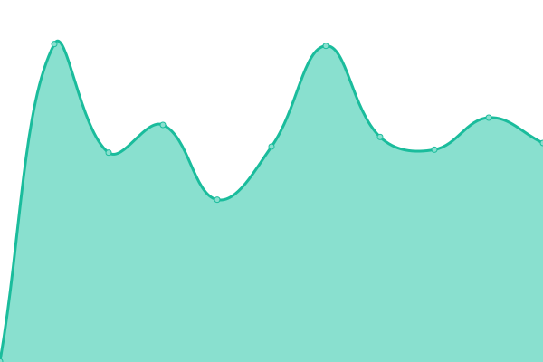
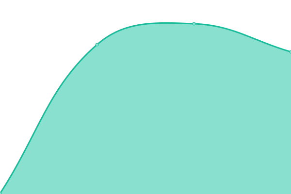

# [📈 Live Status](https://sundowndev.github.io/status): <!--live status--> **🟧 Partial outage**

This repository contains the open-source uptime monitor and status page for [Raphaël](https://crvx.fr/), powered by [Upptime](https://github.com/upptime/upptime).

With [Upptime](https://upptime.js.org), you can get your own unlimited and free uptime monitor and status page, powered entirely by a GitHub repository. We use [Issues](https://github.com/sundowndev/status/issues) as incident reports, [Actions](https://github.com/sundowndev/status/actions) as uptime monitors, and [Pages](https://sundowndev.github.io/status) for the status page.

<!--start: status pages-->
<!-- This summary is generated by Upptime (https://github.com/upptime/upptime) -->
<!-- Do not edit this manually, your changes will be overwritten -->

| URL                                                   | Status  | History                                                                                                      | Response Time                                                                          | Uptime                                                                                                                                                                                                                                 |
| ----------------------------------------------------- | ------- | ------------------------------------------------------------------------------------------------------------ | -------------------------------------------------------------------------------------- | -------------------------------------------------------------------------------------------------------------------------------------------------------------------------------------------------------------------------------------- |
| [crvx.fr](https://www.crvx.fr)                        | 🟩 Up   | [crvx-fr.yml](https://github.com/sundowndev/status/commits/master/history/crvx-fr.yml)                       |  371ms           |                      |
| [PhoneInfoga demo](https://demo.phoneinfoga.crvx.fr/) | 🟩 Up   | [phone-infoga-demo.yml](https://github.com/sundowndev/status/commits/master/history/phone-infoga-demo.yml)   |  322ms |  |
| Nextcloud instance                                    | 🟥 Down | [nextcloud-instance.yml](https://github.com/sundowndev/status/commits/master/history/nextcloud-instance.yml) |  0ms  |  |

<!--end: status pages-->

[**Visit our status website →**](https://sundowndev.github.io/status)

## 📄 License

- Powered by: [Upptime](https://github.com/upptime/upptime)
- Code: [MIT](./LICENSE) © [Raphaël](https://crvx.fr/)
- Data in the `./history` directory: [Open Database License](https://opendatacommons.org/licenses/odbl/1-0/)
