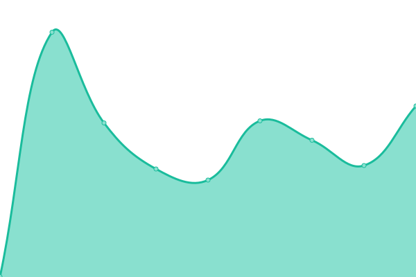
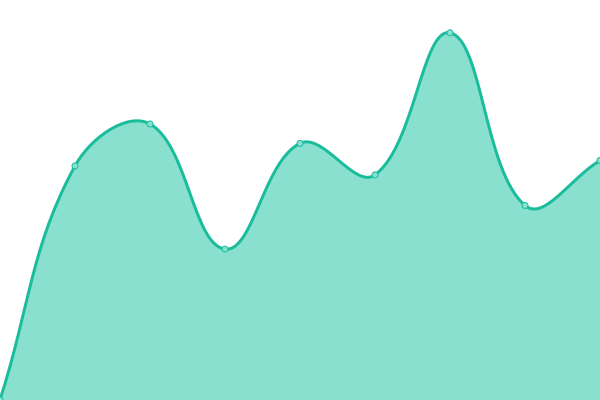

# [📈 Live Status](https://sundowndev.github.io/status): <!--live status--> **🟩 All systems operational**

This repository contains the open-source uptime monitor and status page for [Raphaël](https://crvx.fr/), powered by [Upptime](https://github.com/upptime/upptime).

With [Upptime](https://upptime.js.org), you can get your own unlimited and free uptime monitor and status page, powered entirely by a GitHub repository. We use [Issues](https://github.com/sundowndev/status/issues) as incident reports, [Actions](https://github.com/sundowndev/status/actions) as uptime monitors, and [Pages](https://sundowndev.github.io/status) for the status page.

<!--start: status pages-->
<!-- This summary is generated by Upptime (https://github.com/upptime/upptime) -->
<!-- Do not edit this manually, your changes will be overwritten -->
<!-- prettier-ignore -->
| URL | Status | History | Response Time | Uptime |
| --- | ------ | ------- | ------------- | ------ |
|  [crvx.fr](https://www.crvx.fr) | 🟩 Up | [crvx-fr.yml](https://github.com/sundowndev/status/commits/HEAD/history/crvx-fr.yml) | 

 479ms
     
 | 

<a href="https://sundowndev.github.io/status/history/crvx-fr">100.00%</a>
    

|  [PhoneInfoga demo instance](https://demo.phoneinfoga.crvx.fr) | 🟩 Up | [phone-infoga-demo-instance.yml](https://github.com/sundowndev/status/commits/HEAD/history/phone-infoga-demo-instance.yml) | 

 451ms
     
 | 

<a href="https://sundowndev.github.io/status/history/phone-infoga-demo-instance">100.00%</a>
    

|  Nextcloud instance | 🟩 Up | [nextcloud-instance.yml](https://github.com/sundowndev/status/commits/HEAD/history/nextcloud-instance.yml) | 

 1142ms
     
 | 

<a href="https://sundowndev.github.io/status/history/nextcloud-instance">100.00%</a>
    

|  Onlyoffice instance | 🟩 Up | [onlyoffice-instance.yml](https://github.com/sundowndev/status/commits/HEAD/history/onlyoffice-instance.yml) | 

 467ms
     
 | 

<a href="https://sundowndev.github.io/status/history/onlyoffice-instance">100.00%</a>
    

|  [Dreamvo website](https://dreamvo.com) | 🟩 Up | [dreamvo-website.yml](https://github.com/sundowndev/status/commits/HEAD/history/dreamvo-website.yml) | 

 427ms
     
 | 

<a href="https://sundowndev.github.io/status/history/dreamvo-website">100.00%</a>
    

<!--end: status pages-->

[**Visit our status website →**](https://sundowndev.github.io/status)

## 📄 License

- Powered by: [Upptime](https://github.com/upptime/upptime)
- Code: [MIT](./LICENSE) © [Raphaël](https://crvx.fr/)
- Data in the `./history` directory: [Open Database License](https://opendatacommons.org/licenses/odbl/1-0/)
